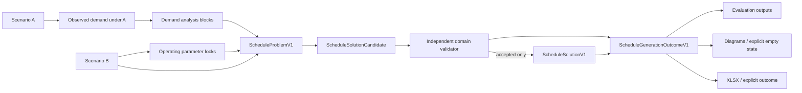

# Domain Model V1

This document organizes the model defined normatively in [Engine Contract V1](ENGINE_CONTRACT_V1.md) and the [Schedule Generation Outcome Contract V1](RESULT_ENVELOPE_CONTRACT_V1.md). If a field or rule here appears ambiguous, the normative contracts prevail.

## Bounded contexts

| Context | Owns | Must not own |
|---|---|---|
| Import/adapters | workbook/UI parsing, source mapping, normalization diagnostics | business feasibility or optimization |
| Domain contracts | scenario, demand, lock, block, timetable, fleet, outcome/result records | Plotly, Streamlit, openpyxl objects |
| Validation | input, parameter, schedule, turnaround, fleet, reconciliation rules | solver search strategy |
| Planning | demand blocks, block supply plan, headway regimes | rendering |
| Solver adapter | candidate construction and solver-specific diagnostics | final conformance decision or UI objects |
| Evaluation | B/C dispositions, block statuses, explanations | source parsing |
| Presentation/export | views and workbook serialization | authoritative demand/supply calculations |

## Aggregate roots

### `ScenarioAInput` and `ScenarioBInput`

Each is an immutable normalized aggregate composed of route identity, `OperatingPlan`, exact `Timetable`, `FleetDeclaration`, operating-day type, and `SourceMetadata`. A and B are distinct even when their values happen to match.

### `ObservedDemandInput`

Contains observation provenance, normalization classification, demand-response mode, and source observations. It is explicitly associated with A. A normalized average-day value retains the original count and denominator for audit.

### `ScheduleProblemV1`

The complete solver-neutral problem: normalized B, authoritative demand blocks, block requirements, operating locks, solver policy, and source fingerprints. A is included for comparison/provenance but is not a mutable solver input.

### `ScheduleGenerationOutcomeV1`

The top-level aggregate returned after the engine decides whether to generate C, attempts a solve, or rejects a candidate. It owns result/execution status, nullable native solver status, fingerprints, explanations, limitations, an optional accepted solution, and limited rejected-candidate diagnostics.

### `ScheduleSolutionV1`

The authoritative accepted Scenario C only. A raw solver candidate is never a solution until the independent validator passes and reconciliation checks in Contract V1 §14 succeed. No-run, infeasible, and rejected outcomes have `solution = null` and must not fabricate C artifacts.

## Core value objects and entities

| Model | Identity | Purpose |
|---|---|---|
| `RouteIdentity` | route ID | route name/type and terminal identities |
| `OperatingWindow` | scenario + terminal | first/last departure and service-day semantics |
| `TurnaroundRule` | scenario + terminal | configured and regulatory minimum |
| `FleetDeclaration` | scenario | required available upper bound, optional approved metadata, and constraint mode |
| `InitialFleetPositioning` | scenario | solver-determined, fixed, or bounded starting stock policy |
| `TerminalStockEvent` | scenario + terminal + event order | event-level stock before/after and trip/ready evidence |
| `TimetableTrip` | scenario + trip ID | exact directional departure and optional assignment |
| `ObservedDemandRecord` | observation ID | source-grain passenger observation |
| `DemandResolutionContract` | demand dataset ID | source grain and block-construction policy |
| `DemandAnalysisBlock` | block ID | authoritative analysis interval and provenance |
| `BlockSupplyPlan` | scenario + direction + block ID | Level 1 allocation/evaluation |
| `HeadwayRegime` | regime ID | continuous Level 2 service pattern |
| `TripTrace` | C trip ID | one-to-one B→C trace and explanation |
| `OperatingParameterLock` | field name | inherited B value and lock evidence |
| `FleetAssignment` | C trip ID | vehicle chain and readiness evidence |
| `EvaluationDimension` | scenario + dimension | status, issues, evidence, confidence |
| `DiagnosticCandidate` | candidate fingerprint | non-authoritative rejection codes and summary only |

## Relationships

## Identity and immutability

- A and B normalized inputs are immutable during an analysis run.
- C holds the B source fingerprint and one trace per B trip in `fixed_by_direction` mode.
- Block IDs and regime IDs are stable within an accepted solution fingerprint.
- Every outcome has its own fingerprint; only accepted outcomes also contain a solution fingerprint.
- Presentation objects may be regenerated, but authoritative values and applicable fingerprints must remain identical.

## Invariants

The complete normative set is in Contract V1 §§3, 4, 8–10, and 14 plus the result-envelope contract. The aggregate boundary must enforce, at minimum: B parameter locks, total/directional counts, first/last departures, vehicle location/readiness, continuous non-negative terminal stock, `minimum_required_fleet <= available_fleet_limit`, initial-position reconciliation, planned-versus-actual block counts, and one-to-one traceability. Demand-block boundaries never reset fleet inventory.

An accepted outcome must contain a complete validated solution. A non-accepted outcome must contain no authoritative C block plan, timetable, regime, assignment, or fleet result. Rejected candidate diagnostics are never authoritative Scenario C.

## Domain services

- `InputNormalizer`: legacy shape → normalized contracts plus diagnostics.
- `BusinessValidator`: validates inputs and B parameter consistency.
- `DemandBlockBuilder`: source observations → authoritative blocks.
- `ScheduleEvaluator`: exact timetable + blocks → dimensioned evaluation.
- `ProblemBuilder`: validated inputs → `ScheduleProblemV1`.
- `ScheduleSolver`: problem → raw candidate.
- `DomainSolutionValidator`: raw candidate → accepted or rejected validation result, including independent terminal-stock replay.
- `GenerationOutcomeFactory`: evaluation/execution/validation result → `ScheduleGenerationOutcomeV1`.
- `SolutionFingerprintService`: canonical serialization → solution/outcome fingerprints.

All services above are framework-neutral. Adapters translate their outputs for UI and export.
