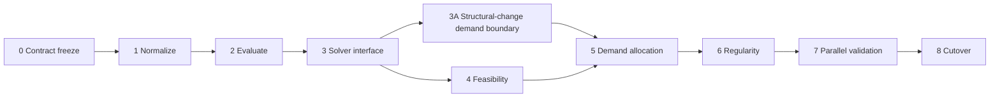

# Migration Roadmap to OR-Tools

This roadmap implements [Engine Contract V1](ENGINE_CONTRACT_V1.md) incrementally. Each stage preserves the current runtime until its exit gate is approved.

## Stage 0 — Contract freeze

Approve the canonical contract, draft schemas, terminology, unresolved decisions, diagram wireframes, workbook sheet contract, fixtures, and benchmark machine/targets.

**Exit gate:** Contract V1 review sign-off; schemas/examples validated; no unresolved decision capable of changing hard solver constraints.

## Stage 1 — Domain normalization

Introduce normalized A/B/demand inputs, required available fleet limit, optional approved fleet metadata, fleet constraint/initial-positioning modes, source metadata, operating-day semantics, adapters, and business validators. Keep current Excel/UI behavior through compatibility adapters.

**Exit gate:** legacy fixtures normalize deterministically; no source workbook mutation; A/B exact timetables and fingerprints reconcile.

## Stage 2 — Authoritative evaluation

Implement source-resolution detection, native/adaptive/manual block builder, variable-duration rates, one-sided LF statuses/objectives, dimensioned B evaluation, and authoritative A/B block supply rows.

**Exit gate:** resolution/LF/B-disposition suites pass; remove symmetric LF scoring from authoritative decisions; UI/export can consume evaluation rows without recalculation.

## Stage 3 — Solver interface

Add `ScheduleProblemV1`, `ScheduleSolver`, raw candidate, independent validator, and `ScheduleSolutionV1`. Wrap the existing heuristic as a temporary adapter without claiming solver proof.

**Exit gate:** heuristic output crosses the new boundary, passes independent validation, and produces a full solution fingerprint; existing runtime remains behaviorally equivalent.

## Stage 3A — Structural-change demand boundary

Implement Amendment V1-A1: schema/domain version `1.1.0`, derived total/directional/local service-change metrics, support classifications, unresolved-demand disposition/result, scenario catalogue/provenance, UI selection workflow, scenario-aware visualization/XLSX, and monitoring contract.

Hard-constraint OR-Tools feasibility work may proceed in parallel. Production-conforming demand allocation for structural-change cases is blocked until Stage 3A exits.

**Exit gate:** extreme/coarse-resolution fixtures prove no fabricated departure-level demand; scenario assumptions are fully traceable; UI/export distinguish observed demand from scenarios; unresolved cases cannot return binary demand suitability or authoritative demand-optimized C.

## Stage 4 — OR-Tools feasibility solver

Implement only hard constraints: counts, direction mode, endpoints/windows, order, runtime/turnaround, solver-determined or explicit initial terminal positioning, continuous event-level terminal stock, available fleet upper bound, minimum service, and block reconciliation. Report any feasible C or prove infeasibility for the encoded problem.

**Exit gate:** tiny proof cases, initial-position reconciliation, non-negative stock, fleet-margin, and turnaround invariants pass; V1 solver statuses are accurately surfaced.

## Stage 5 — OR-Tools demand allocation

Add Level 1 block allocation and lexicographic no-service/90%/85% overload stages. Keep static demand limitations explicit. Structural-change cases require completed Stage 3A scenario/calibration support and MUST NOT optimize against coarse A demand as if it were fine-grained B demand.

**Exit gate:** one-sided objective tests and demand-allocation regression suite pass; no higher-priority degradation between stages.

## Stage 6 — Timetable regularity

Add exact-time refinement, continuous regimes, balanced headways, gap/regime objectives, stable-B preservation, and shift minimization.

**Exit gate:** planned/actual blocks reconcile; regularity and traceability suites pass; first/last and fleet remain hard.

## Stage 7 — Parallel validation

Run current heuristic, CP-SAT, and expert-reviewed timetables over the approved corpus. Produce comparable objective vectors, feasibility evidence, explanations, and performance reports.

**Exit gate:** no CP-SAT hard-rule regressions; agreed quality/performance thresholds met; exceptions signed and documented.

## Stage 8 — Cutover

Switch the production solver adapter behind a controlled feature flag. Update primary diagrams and XLSX to consume `ScheduleSolutionV1`. Retain rollback and the heuristic adapter during a defined observation window.

**Exit gate:** monitoring clean, exported fingerprints consistent, operational sign-off complete. Retire the heuristic only after the regression and benchmark gates pass.

## Dependency sequence

## Rollback and compatibility

Stages 1–3 are additive and keep legacy adapters. Stages 4–7 run side by side and never overwrite the source. Every comparison stores problem, source, configuration, and solution fingerprints. A failed domain validation or unacceptable solver status falls back to a clearly labeled legacy result or no result according to approved policy; it never fabricates C.

## First implementation backlog after approval

1. Resolve Contract V1 §17 business decisions.
2. Promote schemas from draft and generate typed domain models.
3. Build normalization and independent validation fixtures.
4. Implement authoritative demand blocks and B disposition.
5. Introduce solver interface/heuristic adapter.
6. Implement V1-A1 service-change classification, scenario workflow, and `1.1.0` contracts.
7. Benchmark event-balance/reservoir and connection-graph fleet formulations on tiny and 40–80 trip cases.
8. Implement CP-SAT hard feasibility in parallel with V1-A1; add demand allocation only after both gates pass.
9. Complete visualization/export cutover only after solution and scenario reconciliation are stable.
