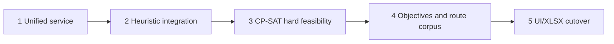

# Migration Roadmap to OR-Tools

**Status:** Active roadmap

**Governing direction:** [Project Direction Reset](PROJECT_DIRECTION_RESET.md)

This roadmap moves the current dual stack to one practical application pipeline. It preserves the
legacy runtime until each replacement boundary is validated and keeps solver behavior behind the
canonical problem, raw-candidate, and independent-validator contracts.

## Milestone 1 — Documentation reset and unified application service

Establish the active direction and design one application service that owns:

```text
normalize
-> evaluate B
-> quantify adjustment need
-> build ScheduleProblemV1 when solving is appropriate
-> select solver
-> independently validate
-> compare
-> return presentation/export data
```

The service uses ordinary typed function calls and configuration. It does not require capability
routing, authorization profiles, legacy projections, authorized-problem requests, orchestration
envelopes, or an internal authorization fingerprint chain.

During this milestone:

- keep the current Streamlit/runtime path working;
- retain V1-D2 Phase A as the quantitative pre-problem evaluator;
- define a transparent solver-comparison objective vector;
- identify one authoritative owner for fleet limits, demand authority, and outcome status; and
- add characterization tests for current legacy application behavior.

**Exit gate:** one reviewed service API and integration plan; legacy behavior characterized;
documentation agrees that the UI is still legacy and OR-Tools is not implemented.

## Milestone 2 — Heuristic integration through the canonical boundary

Make the existing deterministic heuristic the first solver behind:

```text
ScheduleProblemV1
-> ScheduleSolver
-> raw candidate
-> independent domain validator
-> ScheduleGenerationOutcomeV1
```

Do not rewrite the heuristic algorithm in this milestone. Adapt its inputs and outputs, preserve
exact source runtimes, validate terminal-specific turnaround independently, and remove any
application assumption that a heuristic candidate is authoritative before validation.

The legacy weighted score may remain visible for compatibility, but solver comparison and
acceptance use hard feasibility plus the transparent objective vector.

**Exit gate:** the heuristic application path produces the same operational result through the
canonical boundary; deliberately corrupted candidates are rejected; no UI/export cutover is
required yet.

## Milestone 3 — OR-Tools hard-feasibility solver

Implement `OrToolsCpSatScheduleSolver` for the first fixed-resource target:

- one route and two terminals;
- fixed total and directional trip counts;
- exact source-trip runtimes;
- terminal-specific turnaround;
- locked first and last departures;
- strict chronological order and B-to-C traceability;
- available-fleet upper bound;
- solver-determined initial terminal positioning;
- continuous non-negative terminal stock; and
- independent post-solve validation.

The first CP-SAT pull request contains no demand objective. It reports native statuses honestly:
`OPTIMAL`, `FEASIBLE`, `INFEASIBLE`, `MODEL_INVALID`, and `UNKNOWN`.

Build 4-12-trip hand-solvable fixtures for one chain, unavoidable second vehicle, initial split,
terminal imbalance, equal-time ready/departure ordering, tight fleet, endpoint locks, and
infeasibility. Compare with exhaustive enumeration where practical.

**Exit gate:** every hard-feasibility proof passes; the independent validator accepts valid
candidates and rejects corrupted ones; no result relabels `FEASIBLE` as optimal or `UNKNOWN` as
infeasible.

## Milestone 4 — Fixed-resource demand/headway optimization and route corpus

After hard feasibility is stable, add lexicographic objectives in this order:

1. no-service demand blocks;
2. critical blocks and overload above 90%;
3. overload above 85%;
4. excessive service gaps;
5. sustained-demand alignment;
6. headway regularity and transition control;
7. stable B preservation;
8. shifted-trip count, total shift, and maximum shift; and
9. fleet only as a late tie-breaker.

Use authoritative demand grain and never fabricate directional or finer-resolution demand.
Compare the heuristic and CP-SAT with the same objective vector and validation result.

Build an anonymized route corpus with balanced/asymmetric directions, tight/loose fleet, difficult
headway patterns, unequal terminal turnaround, and feasible/infeasible cases. Add Route 61-8 and
Route 61-4 when anonymized source data and provenance are available.

**Exit gate:** heuristic/CP-SAT differential tests and route-corpus regressions pass; higher
priority objectives never degrade for a lower-priority improvement; benchmark results and solver
controls are recorded.

## Milestone 5 — UI/XLSX cutover and side-by-side validation

Run the unified service beside the legacy application path over the approved corpus. Reconcile:

- B evaluation;
- generation outcome and solver status;
- hard-feasibility evidence;
- objective vector;
- exact timetable and B-to-C trace;
- fleet and initial positioning;
- charts; and
- editable XLSX values and fingerprints.

Then make the unified Contract V1 service authoritative for Streamlit, diagrams, and XLSX. Remove
presentation-layer recomputation and retain a time-bounded rollback path during operational
review.

**Exit gate:** UI and exporters consume the same authoritative outcome/solution; source workbooks
are never overwritten; side-by-side differences are approved; the legacy path can be retired
without losing required capabilities.

## Dependency sequence



## Later optional work

The following are explicitly outside the five required milestones:

- variable-trip-count increase or reduction;
- redistribution of total trips between directions;
- structural demand-response scenarios and calibrated ridership response;
- V1-A1 scenario selection, UI, export, and monitoring;
- mixed fleets, multi-route interlining, deadhead, driver duties, depot, and maintenance.

These may begin only after fixed-resource hard feasibility and the active route corpus are stable.
V1-A1 does not block Milestone 3.

## Rollback and compatibility

Milestones 1-4 keep the current application available for comparison and never overwrite the
source workbook. A failed solver run or failed domain validation produces an explicit
non-accepted outcome; it never fabricates Scenario C or silently substitutes B.

Persisted/cached inputs, problems, candidates, solutions, and outcomes may use fingerprints for
identity and reconciliation. Fingerprints do not authorize calls between internal Python
functions.
